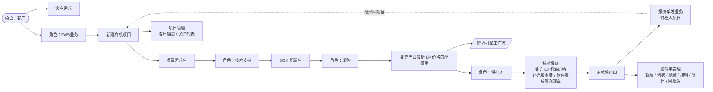
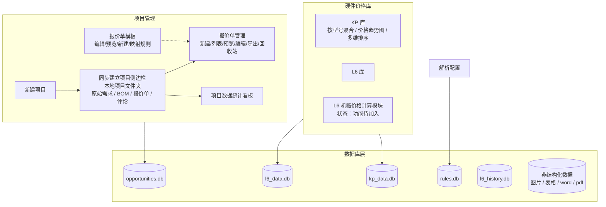

# 业务流程

> 版本：v0.1.11 | 更新日期：2026-07-11
> 本文由 `docs/业务流程图.canvas`（Obsidian Canvas）转写而来，便于在普通编辑器中查看与 AI 解析。

## 核心业务链路

从客户需求到正式报价单的完整流程，按角色驱动：

## 报价策略（商业逻辑）

不同客户类型对应不同的报价策略，影响定价与利润率核算：

- **首接下单客户**（最终用户、集成商、代理商）：直接出货折扣报价。
- **做预算类客户**：报价注水较多，厂商报给集成商、集成商再报给甲方，价格约为出货价的 2 倍。
- **按付款方式定价**：回款有风险的，原厂通常需要总代垫资，价格随之调整。
- **高粘性 / 重复采购客户**：首单可能赔钱卖，后续订单找补（单纯服务器操作较难，通常需软硬组合）。

> 以上策略直接影响 `QuoteService` 的利润率核算参数，修改定价逻辑时需结合这些业务背景。

## 系统模块与数据库对应

## 报价单结构（四段式）

一份完整报价单在系统内拆分为四个区段，对应工作台的编辑区域：

1. **项目基础信息** — 客户、项目名等
2. **L6 机箱配置** — 整机配置与机箱价格
3. **Key Part** — 关键零部件（CPU/内存/硬盘/网卡/GPU 等）
4. **质保信息** — 服务与保修条款

## 商机跟踪（远景规划）

画板中包含尚未实现的分析维度，属规划而非现状：

- 成单率统计数据分析（人、业务对成单率的影响）
- 简化 LTC（线索到回款）流程
- 需求完整度评估（需求配置明确 / 模糊 / 有倾向性招标参数等）

## 功能 TODO

- **L6 机箱价格计算模块** — 计算 L6 机箱价格，存入数据库，供报价工作台引用。当前状态：**功能待加入**。
